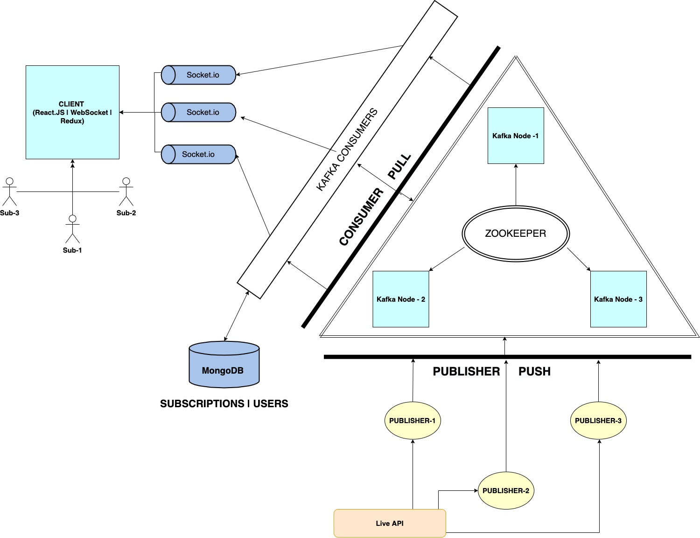
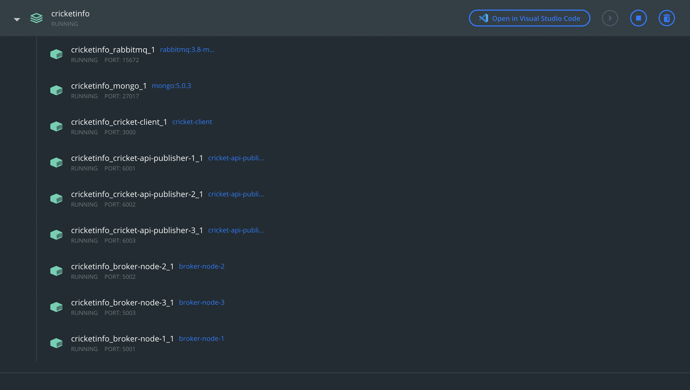
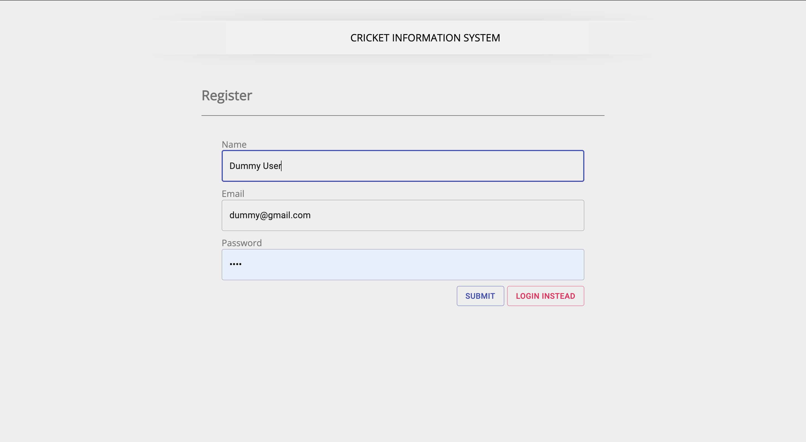
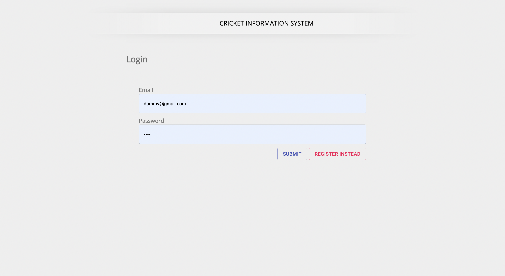
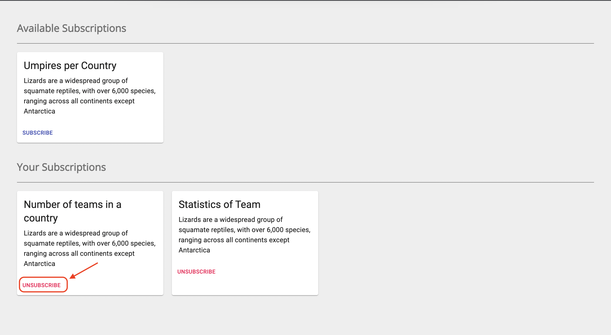
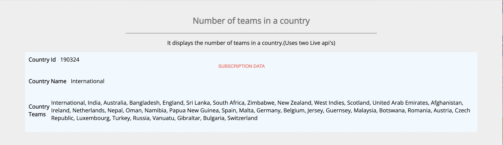
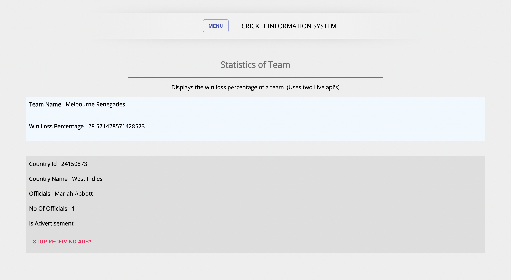
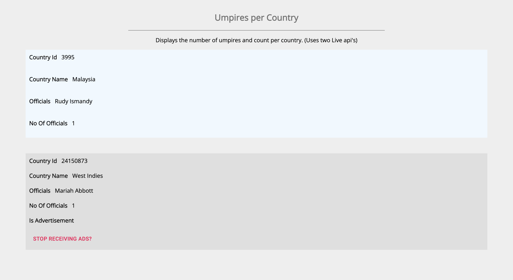
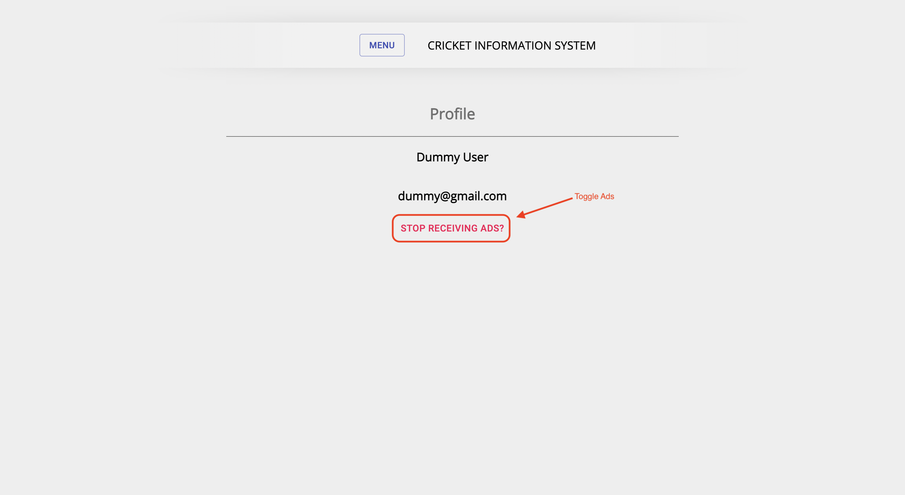

# Cricket Information System (Phase-2)


This repository contains:

- A client folder.
- Server files.
- 3 Publisher folders.
- Docker file.
- Docker compose file for dockerizing all the parts.(10 in all)

## Table of Contents

- [Background](#background)
- [WebStack](#webstack)
- [Prerequisites](#prerequisites)
- [CurrentStatus](#currentstatus)
- [Installation](#installation)
- [Working](#working)
- [Contributing](#contributors)

## Background

We aim to create a distributed system that notifes the user about various cricketing statistics presently going on. The user will have the flexibilty to choose the type of notifications it desires and the system will only send the relevant information to it. We will be using KAFKA as our core to make this pub sub architecture.
We will be publishing the app on Docker so that the app is platform independant and can be used ubiquitously.

## WebStack 

- Front-End Development: React, Redux, Web Stomp, Web Socket
- Back-End Development : KAFKA,Node JS, mongoose
- Database: MongoDB
- Deployment : Docker

## Prerequisites:

- [node](http://nodejs.org)
- [npm](https://npmjs.com)
- [fastify](https://www.fastify.io/)
- [fastify-cors](https://www.npmjs.com/package/fastify-cors)
- [mongoose](https://mongoosejs.com/docs/)
- [nodemon](https://www.npmjs.com/package/nodemon)
- [uuid](https://www.npmjs.com/package/uuid)
- [react](https://reactjs.org/)
- [redux](https://redux.js.org/)
- [axios](https://axios-http.com/docs/intro)
- [highcharts](https://www.highcharts.com/)
- [react-dom](https://reactjs.org/docs/react-dom.html)
- [react-redux](https://react-redux.js.org/)
- [react-scripts](https://www.npmjs.com/package/react-scripts)
- [redux-thunk](https://github.com/reduxjs/redux-thunk)
- [docker](https://www.docker.com/)
- [socket.io](https://socket.io/)
- [KAFKA](https://kafka.js.org/)

## CurrentStatus

**7th December,2021:** We have created a full architecture of 3 Kakfka broker nodes and n number of subscribers that interact with each other in our pub sub model. The client can subscribe to three subscriptions and the data will be displayed in his dashboard. The three kafka broker nodes are connected to a single zookeeper that is responsible for managing and coordination between these nodes. The publisher extracts the data from the live api and pushes the data into the respective kafka broker nodes with the help of the zookeeper. When the consumer pulls the data for a particular subscribed topic the zookeeper facilitates the request by extracting the data from the appropriate kafka broker node. For every topic we have created two partitions that will help in replication of data and thus fault tolerance. The KAFKA comsumer and the producer communicate via sockets to exchange messages. 

### Architectural Model




### Backend Status:

#### Ports

- Backend: 5000
- Backend Socket: 5004
- MongoDb: 27017
- Publisher1: 7001
- Publisher2: 7002
- Publisher3: 7003
- ZooKeeper: 2181
- Kafka-Broker1: 19092
- Kakfa-Broker2: 19093
- Kafka-Broker3: 19094

#### API's:

[SportMonks](https://docs.sportmonks.com/cricket/) : An external cricketing API was used to fetch relevant data for the subscriber.

#### Subscriptions:

- Number of teams in a country: It displays the number of teams in a country.(Uses two api's)
- Statistics of Team: Displays the win loss percentage of a team.(Uses two api's)
- Umpires per Country: Displays the number of umpires and count per country.(Uses two api's)

#### Database Schema:

- The user subscription data base.

```
const userSchema = new mongoose.Schema({
  name: String,
  email: String,
  password: String,
  status: Number,
  subscribedTopicIds: Array,
  receiveAdvertisements: Boolean,
});

```

- The topic data base.

```
  const topicSchema = new mongoose.Schema({
   topicName: String,
   topicDescription: String,
   topicId: String,
   topicData: Array,
   topicStatus: Number,
 });
```

### KAFKA Deployment
Visualization of KAFKA is done using CONDUKTOR.


### Docker Deployment


### Frontend Status:

#### Ports

- Frontend: 3000

#### Features

- A subscriber can create his profile on the page using email address.
- A user can login and check the subscriptions available.
- The user can subscribe or unsubscribe to the subscriptions.
- On clicking the subscribed topics the data will be visible.

#### Screenshots

- New user registration

  

- Logging the new user in

  

- Main landing page

  

- Showing topics that the user can subscribe to

  

- Showing the users subscription.

  

- Going to the subscription page of topic one (Teams available in a country) 

  

- Topic 2: Team Win Statistics

  
  
- Topic 3: Umpires By Country

  
  
- Advertisement button toggle

  

## Installation

The following commands are executed from the root directory.

```sh
docker-compose down
cd Publisher1
docker build -t cricket-api-publisher-1 .
cd ../Publisher2
docker build -t cricket-api-publisher-2 .
cd ../Publisher3
docker build -t cricket-api-publisher-3 .
cd ../client
docker build -t cricket-client .
cd ..
docker build -t cricket-api .
docker-compose up --remove-orphans
```


## Contributors

[@RahulSharma](https://github.com/webber2408).
- Frontend
- KAFKA Consumer

[@AruvanshNigam](https://github.com/Aruvansh1997).
- Publisher
- KAFKA Producer

