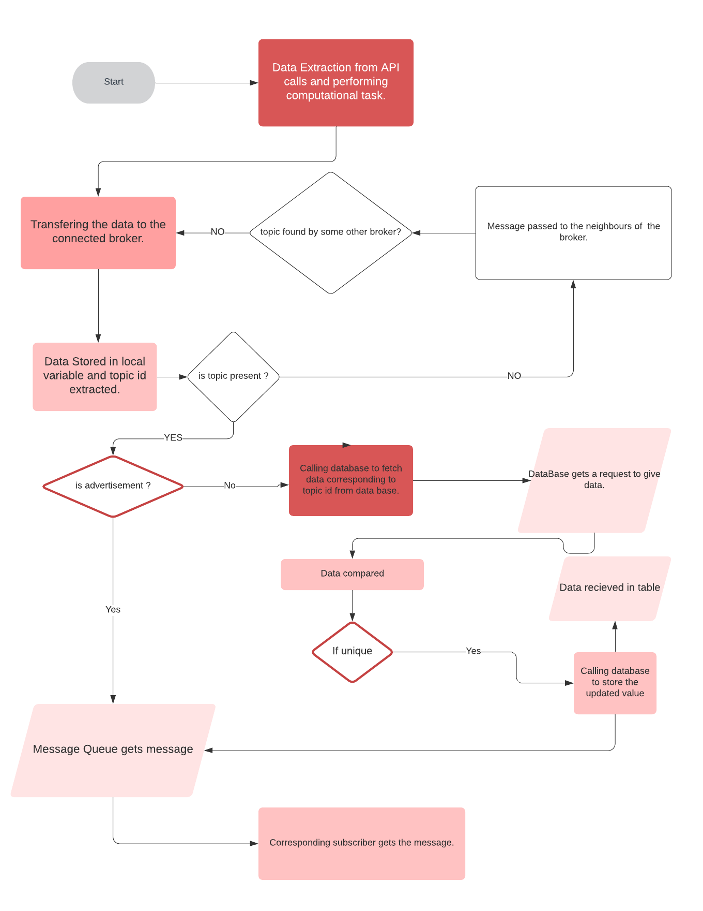
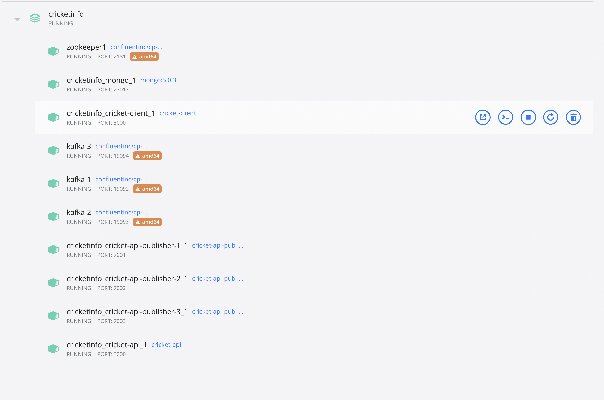
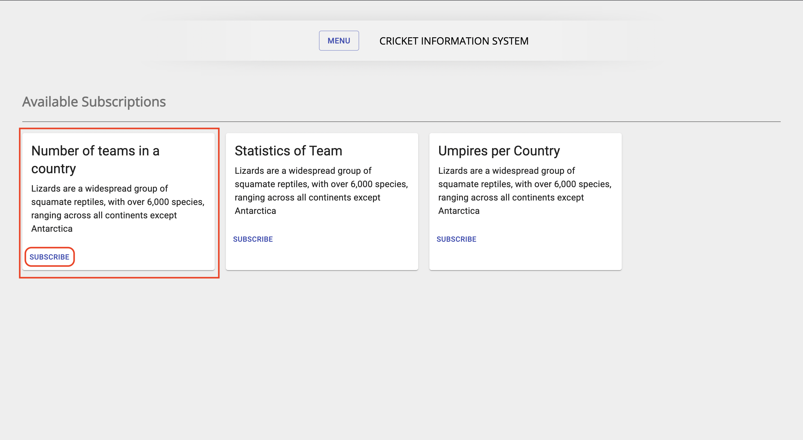

# Distributed Systems Project (CSE-574) - [Authors](#contributors)
# Cricket Information System (Phase-3) 


This repository contains:

- A client folder.
- 3 Server Folders.
- 3 Publisher folders.
- Docker file.
- Docker compose file for dockerizing all the parts.(9 in all)

## Table of Contents

- [Background](#background)
- [WebStack](#webstack)
- [Prerequisites](#prerequisites)
- [CurrentStatus](#currentstatus)
- [Installation](#installation)
- [Contributing](#contributors)

## Background

We aim to create a distributed system that notifes the user about various cricketing statistics presently going on. The user will have the flexibilty to choose the type of notifications it desires and the system will only send the relevant information to it.
We will be publishing the app on Docker so that the app is platform independant and can be used ubiquitously.

## WebStack

- Front-End Development: React, Redux, Web Stomp, Web Socket
- Back-End Development : Node JS, socket-io, mongoose
- Database: MongoDB
- Deployment : Docker
- Middleware : RabbitMQ

## Prerequisites:

- [node](http://nodejs.org)
- [npm](https://npmjs.com)
- [fastify](https://www.fastify.io/)
- [fastify-cors](https://www.npmjs.com/package/fastify-cors)
- [mongoose](https://mongoosejs.com/docs/)
- [nodemon](https://www.npmjs.com/package/nodemon)
- [uuid](https://www.npmjs.com/package/uuid)
- [react](https://reactjs.org/)
- [redux](https://redux.js.org/)
- [axios](https://axios-http.com/docs/intro)
- [highcharts](https://www.highcharts.com/)
- [react-dom](https://reactjs.org/docs/react-dom.html)
- [react-redux](https://react-redux.js.org/)
- [react-scripts](https://www.npmjs.com/package/react-scripts)
- [redux-thunk](https://github.com/reduxjs/redux-thunk)
- [docker](https://www.docker.com/)
- [socket.io](https://socket.io/)
- [RabbitMQ](https://www.rabbitmq.com/)

## CurrentStatus

**5th November,2021:** We have created a full architecture of 3 publishers and n number of subscribers that interact with each other in our pub sub model. Our middleware is RabbitMQ(for time and space uncoupling) which serves as queue to transfer messages from the broker node to the client. The broker node uses rendezvous architecture to transfer messages between each other so that the relevant broker gets the value. The client can subscribe to nine subscriptions and the data will be displayed in his dashboard. Also there are advertisements that pop up in the middle in each topic that lets user know what other data is being displayed in other topics. The user is given the flexibility to turn off or on the adds as he deems fit. The data transferred by the publisher to the broker is also being transferred to the database. The data is transferred into the database only when there is a change in the data, thus preventing replications. We have also provisioned that advertisements are not pushed in the database.

### 1. Architectural Model


### 2. Broker Publisher Mapping


### 3. Algorithm Workflow



### Backend Status:

#### Ports

- MongoDb: 27017
- RabbitMq: 5672,15672,61613,15674
- Publisher1: 6001
- Publisher2: 6002
- Publisher3: 6003
- BrokerNode1: 5001
- BrokerNode2: 5002
- BrokerNode3: 5003
- Publisher-Sockets: 7001,7002,7003
- Broker-Sockets: 3001,3002,3003

#### API's:

[SportMonks](https://docs.sportmonks.com/cricket/) : An external cricketing API was used to fetch relevant data for the subscriber.

#### Subscriptions:

- Number of teams in a country: It displays the number of teams in a country.(Uses two api's)
- Statistics of Team: Displays the win loss percentage of a team.(Uses two api's)
- Umpires per Country: Displays the number of umpires and count per country.(Uses two api's)
- Stadiums by Venue: Displays the venures by stadium
- Countries where cricket is played
- Top performing cricket teams
- Name of seasons played in cricket 
- Status of cricket matches played
- Schedules of the matches to be played

#### Database Schema:

- The user subscription data base.

```
const userSchema = new mongoose.Schema({
  name: String,
  email: String,
  password: String,
  status: Number,
  subscribedTopicIds: Array,
  receiveAdvertisements: Boolean,
});

```

- The topic data base.

```
  const topicSchema = new mongoose.Schema({
   topicName: String,
   topicDescription: String,
   topicId: String,
   topicData: Array,
   topicStatus: Number,
 });
```

### RabbitMQ Deployment
Number of Subscribers : n

Number of topics: m

Advertisements: 1

Queues in Rabbit MQ: (m * n) + 1

Queue Name:  queue.[USER_EMAIL]_[TOPIC_UNIQUE_UUID]


### Docker Deployment



### Frontend Status:

#### Ports

- Frontend: 3000

#### Features

- A subscriber can create his profile on the page using email address.
- A user can login and check the subscriptions available.
- The user can subscribe or unsubscribe to the subscriptions.
- On clicking the subscribed topics the data will be visible along with advertisements.
- User can opt out to recieve advertisements or opt in.

#### Screenshots

- New user registration

  

- Logging the new user in

  

- Main landing page

  

- Showing topics that the user can subscribe to

  

- Showing the users subscription.

  

- Going to the subscription page of topic one (Teams available in a country) where you can see advertisements and its unsubscribe button

  

- Topic 2: Team Win Statistics

  

- Topic 3: Umpires By Country

  

- Advertisement button toggle

  

## Installation

The following commands are executed from the root directory.

```sh
  cd client
  docker build -t cricket-client .
  cd ../Publisher1
  docker build -t cricket-api-publisher-1 .
  cd ../Publisher2
  docker build -t cricket-api-publisher-2 .
  cd ../Publisher3
  docker build -t cricket-api-publisher-3 .
  cd ../server1
  docker build -t broker-node-1 .
  cd ../server2
  docker build -t broker-node-2 .
  cd ../server3
  docker build -t broker-node-3 .
  cd ..
  docker-compose up --remove-orphans
```

Post RabbitMQ docker deployment, enable Web STOMP by:

```sh
rabbitmq-plugins enable rabbitmq_web_stomp
```

## Contributors

[@RahulSharma](https://github.com/webber2408).
- Frontend
- Middleware (RabbitMQ)
- Subscriber Rendezvous
- Database

[@AruvanshNigam](https://github.com/Aruvansh1997).
- Backend
- Publisher Rendezvous
- Middleware (Socket.io Interations)
- Database
